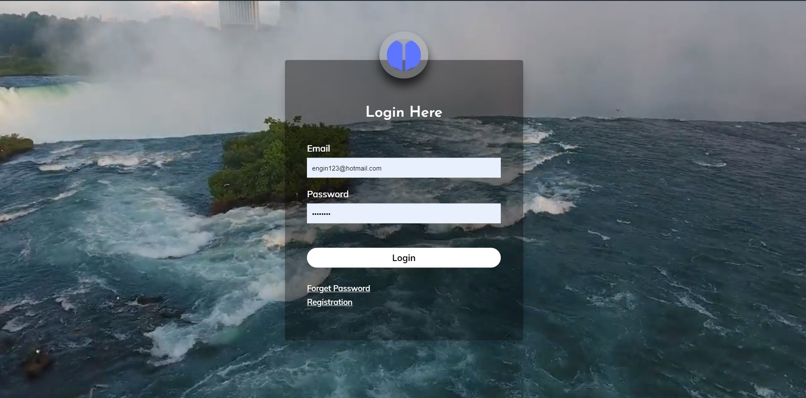
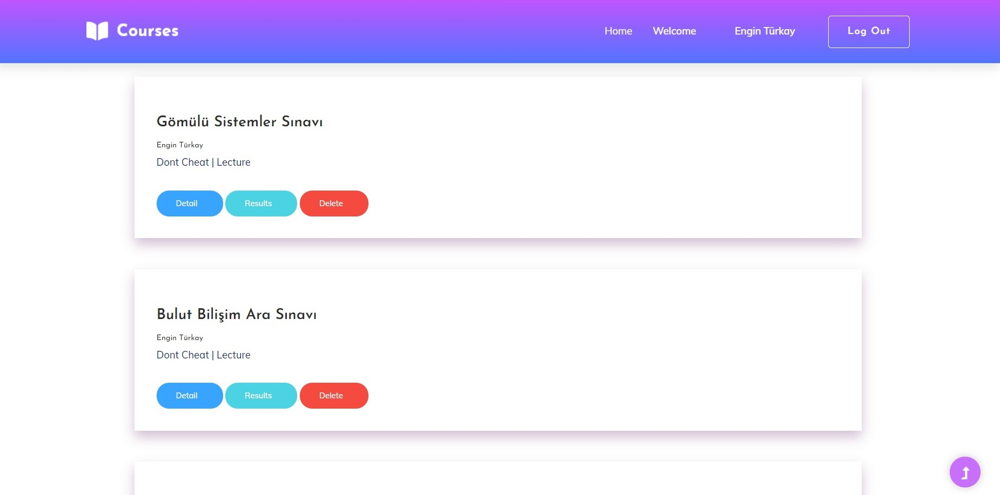
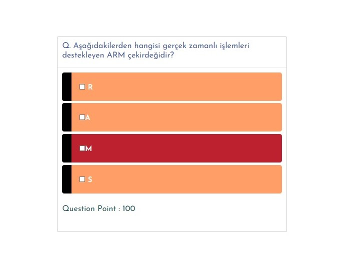
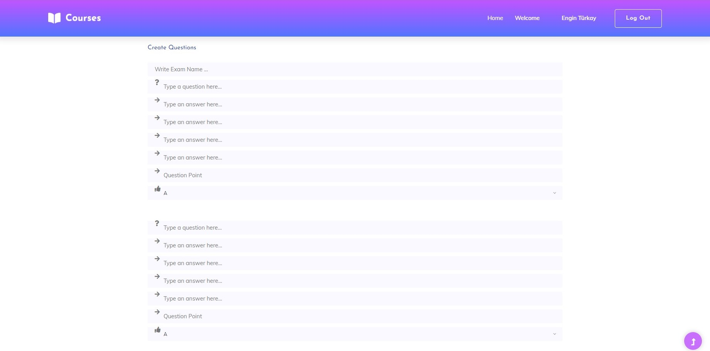
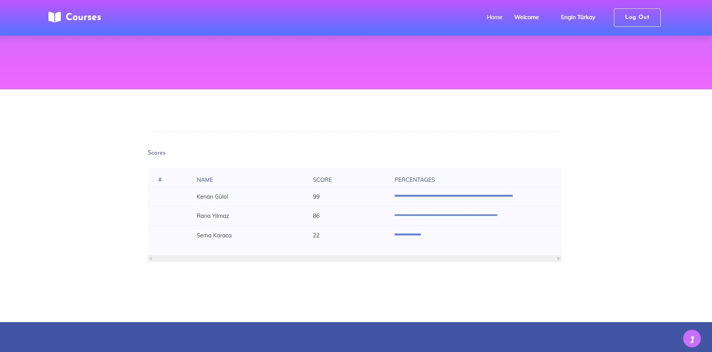

# CloudApp
# Exam Application for Students and Instructors

You can create exams, join exams, see global grades with this exam app. This is a django app.

















Student Login Info 
email :semakaraca@hotmail.com
pssw: 123456

Instructor Login Info

email : engin123@hotmail.com
pssw: engin123


To Find Out More Check templatesStatics


Setup

#Creating Virtual Environment For Project
pip install virtualenv
virtualenv env 

Linux & Mac: ```source env/bin/activate```

Windows: ```env\Scripts\activate```

cd SPA\serviceapp

```pip install -r requirements.txt```

```python manage.py makemigrations```

```python manage.py migrate``` #Ignore Warnings#

```python manage.py runserver```

Type your Browser ==> http://127.0.0.1:8000/


